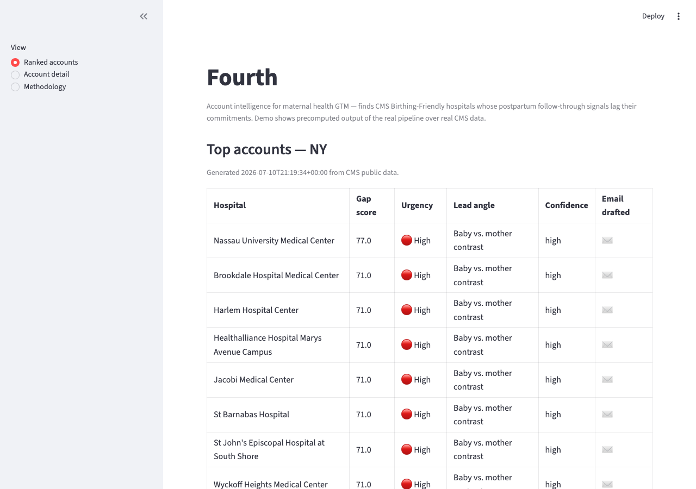
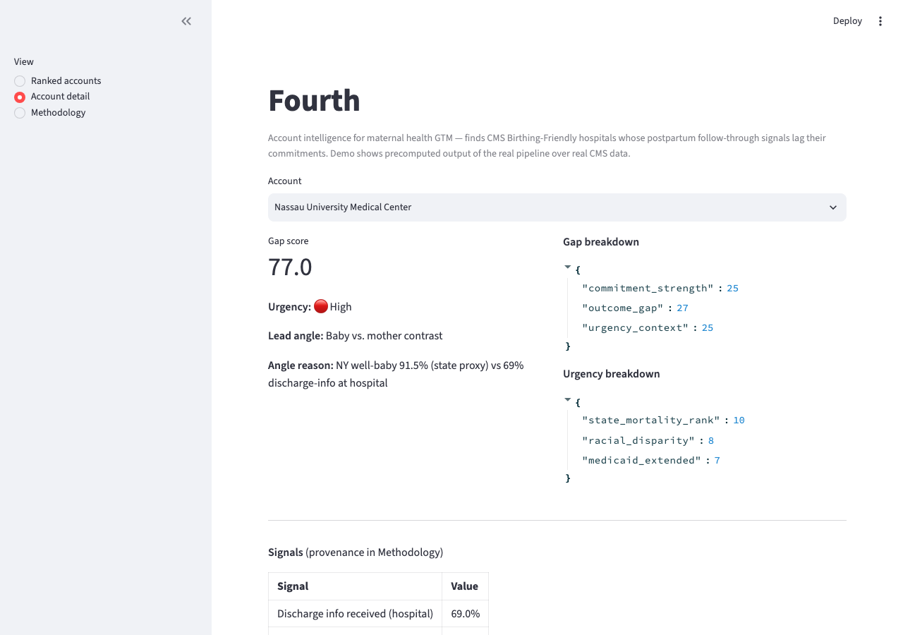
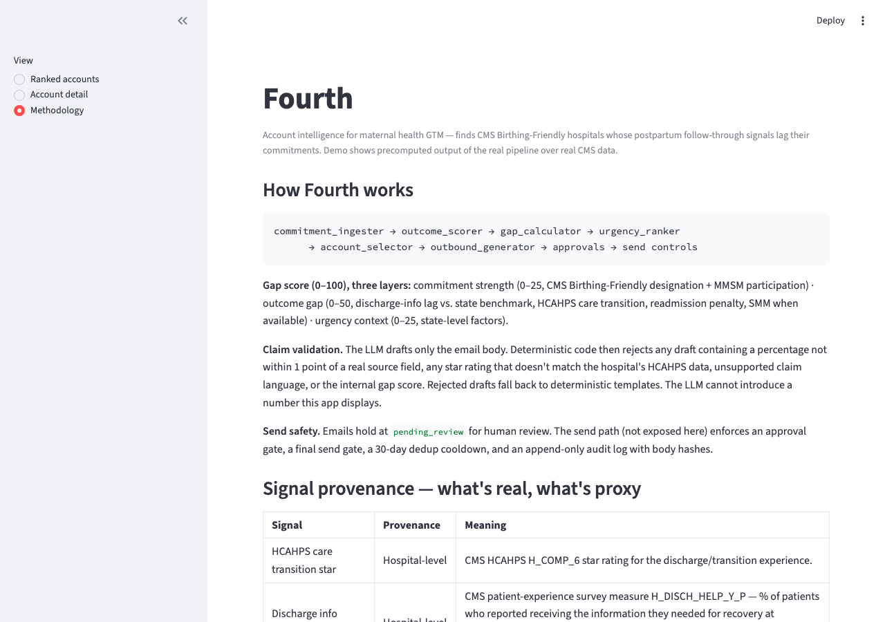

# Fourth — Account Intelligence for Maternal Health GTM

Fourth finds CMS Birthing-Friendly hospitals whose discharge-readiness and
patient-experience signals lag their public maternal health commitments,
ranks them with a 3-layer gap score, and drafts claim-validated outbound
email for a GTM engineer to review. Built for maternal health companies
like Babyscripts; hospitals are the sales targets.

**Live demo:** _coming soon_ · 



## Why this exists

NY completes 82.4% of Medicaid postpartum visits statewide, and well-baby
follow-up runs even higher — yet at many Birthing-Friendly hospitals, far
fewer patients report getting the information they needed for their own
recovery at discharge. Fourth finds those hospitals and turns roughly 90
minutes of manual account research into a 10-minute review.

## What makes it interesting technically

**LLM claim validation.** The model writes only the email body. Deterministic
code rejects any percentage not within 1 point of a source field, any star
rating that doesn't match HCAHPS, and any unsupported claim language before
an email can be marked ready. A failed check falls back to a deterministic
template — the LLM never gets the last word on what a hospital is told.

**Send safety.** Every email passes through a chain before it can go out:
an approval gate (`gap_score >= 70` + high confidence + validation passed),
a final send gate that re-checks all three criteria, a 30-day dedup cooldown
against the audit log, SMTP delivery, and an append-only audit log keyed by
a SHA-256 hash of the email body. Review mode never sends, and the demo app
has no send path at all.

**Data honesty.** Every signal is labeled by what it actually is —
hospital-level, state-level proxy, or not yet available — both in the app's
methodology view and in `SCHEMA.md`. `discharge_info_pct`, for example, is
the CMS HCAHPS measure for information received at discharge, not a
postpartum visit completion rate, and the copy never conflates the two.

## Pipeline

```text
commitment_ingester
  -> outcome_scorer
  -> gap_calculator
  -> urgency_ranker
  -> account_selector
  -> outbound_generator
  -> human_checkpoint
  -> dashboard_generator
```

One hospital dict travels the full pipeline; each tool only adds fields,
never removes or renames one. See `SCHEMA.md` for the field-level contract
and `ADR.md` for the architecture decisions behind it.

## Demo app

A read-only Streamlit app over `data/demo_results.json` — precomputed
output from a real run of the pipeline against real CMS data. No API keys
or pipeline imports required to view it.




## Data sources

| Source | Level | Provides |
|---|---|---|
| CMS Birthing-Friendly registry | Hospital | Birthing-Friendly designation universe |
| CMS HCAHPS (NY) | Hospital | Discharge info %, care transition star, overall star |
| CMS Maternal Health file | Hospital | SMM rate (PC_07a — Not Available in current CMS release) |
| CMS HRRP FY2026 | Hospital | Readmission penalty via Excess Readmission Ratio |
| CMS Medicaid Core Sets, NY 2023 | State | Postpartum visit average (82.4%), well-baby proxy (91.5%) |

## Run it

```bash
python3 -m venv .venv && .venv/bin/pip install -r requirements.txt
.venv/bin/python -m pytest tests/ -q      # offline, no API keys needed
.venv/bin/python src/agent.py NY          # full pipeline, review mode
.venv/bin/streamlit run app.py            # demo app over precomputed results
.venv/bin/python scripts/export_demo_results.py   # regenerate demo data (needs API key)
```

Live generation is optional: set `OPENROUTER_API_KEY` (or `ANTHROPIC_API_KEY`)
in `.env` — see `.env.example` for the full list of variables the code
reads. Without a key, `outbound_generator.py` falls back to deterministic
cached templates. `--send` mode additionally requires SMTP credentials and
is never exposed by the demo app.

## Status & roadmap

Prototype targeting NY. Roadmap: hospital-level SMM once CMS ships PC_07a,
a hospital-level well-baby data source, multi-state expansion, curated
commitment tags, and CRM integration.

---

Fourth grew out of a team class project (ECHO); this repo is the standalone
continuation, built and owned by Luba Kaper.
